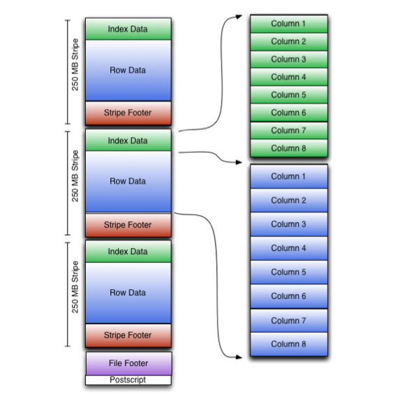

# 动机

Hive的RCFile作为Hadoop表存储格式已经很多年了.但是RCFile由于把Column视作没有任何语义的二进制数据片.在Hive 0.11中,我们增加了一个新的
文件格式,命名为优化的行列文件(Optimized Row Columnar,翻译有点丑),它从表定义中拿到类型信息并保存到文件中,实现了文件级别字描述.ORC为每
个类型实现特定的Reader和Writer,这方便提供更加轻量的编码技术,如字典编码(dictionary encoding)、bit packing、delta encoding 和
run length encoding,以显著的生成更小的文件.此外,即使是很小的文件,ORC可使用常见的压缩如zlib,snappy和zstd进一步压缩,当然收益不仅仅只
时节省存储空间.ORC支持列裁剪,可以查询需要关注的列,所以只读取1列的查询,就仅只需读文件这1列所需的bytes.另外,ORC文件包括轻量级索引,索引
中保存了每一个Stride内每列的最大值或者最小值,在Hive的PPD场景下,reader就可以根据index跳过他们不需要关注的stride.

# File Tail

因为HDFS不支持写后修改文件,ORC存储顶级索引在文件尾部. 文件整体结构如上图所示.整个文件包括3部分:metadata,file footer 和 postscript.

文件的metadata使用PB格式,这提供了在不改变reader的情况下可以增加新列.本文包含了PB定义的源代码,如果读者需要更加详细逻辑,建议可以直接阅读
PB源文件.

File Tail承包括四部分:
* encrypted stripe statistics: 列的stats,目前是最大值最小值
* stripe statistics: Metadata
* footer: Footer
* postscript: PostScript
* psLen: byte