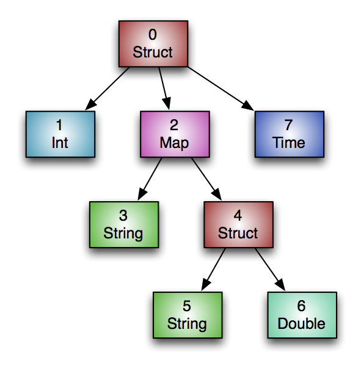

# 动机

Hive的RCFile作为Hadoop表存储格式已经很多年了.但是RCFile由于把Column视作没有任何语义的二进制数据片.在Hive 0.11中,我们增加了一个新的
文件格式,命名为优化的行列文件(Optimized Row Columnar,翻译有点丑),它从表定义中拿到类型信息并保存到文件中,实现了文件级别字描述.ORC为每
个类型实现特定的Reader和Writer,这方便提供更加轻量的编码技术,如字典编码(dictionary encoding)、bit packing、delta encoding 和
run length encoding,以显著的生成更小的文件.此外,即使是很小的文件,ORC可使用常见的压缩如zlib,snappy进一步压缩,当然收益不仅仅只
时节省存储空间.ORC支持列裁剪,可以查询需要关注的列,所以只读取1列的查询,就仅只需读文件这1列所需的bytes.另外,ORC文件包括轻量级索引,索引
中保存了每一个Stride内每列的最大值或者最小值,在Hive的PPD场景下,reader就可以根据index跳过他们不需要关注的stride.


# File Tail

因为HDFS不支持写后修改文件,ORC存储顶级索引在文件尾部. 文件整体结构如上图所示.整个文件包括3部分:metadata,file footer 和 postscript.

文件的metadata使用PB格式,这提供了在不改变reader的情况下可以增加新列.本文包含了PB定义的源代码,如果读者需要更加详细逻辑,建议可以直接阅读
PB源文件.

File Tail承包括四部分:
* encrypted stripe statistics: 列的stats,目前是最大值最小值
* stripe statistics: Metadata
* footer: Footer
* postscript: PostScript
* psLen: byte

# Postscript

Postscript保存一些信息,用来描述文件,包括Footer和Metadata的长度、文件的版本、压缩类型(eg.none,zlib,or snappy).Poststript不会被压缩
并且位于文件结尾处.版本信息是Hive最低版本,它用来能够读或者写的版本号.文件版本被编码为[0,12].

读ORC文件的整个过程向后读取的.ORC read会读1个16K bytes,这包含了Footer和Postscript数据片.文件最后一个byte存储postscript序列化后的
长度,它一定是小于256 bytes.一旦postscript被读取后,Footer长度拿到后,就可以解压以及解析Footer了.

```` protobuf
message PostScript {
// the length of the footer section in bytes
optional uint64 footerLength = 1;
// the kind of generic compression used
optional CompressionKind compression = 2;
// the maximum size of each compression chunk
optional uint64 compressionBlockSize = 3;
// the version of the writer
repeated uint32 version = 4 [packed = true];
// the length of the metadata section in bytes
optional uint64 metadataLength = 5;
// the fixed string "ORC"
optional string magic = 8000;
}

enum CompressionKind {
NONE = 0;
ZLIB = 1;
SNAPPY = 2;
LZO = 3;
LZ4 = 4;
ZSTD = 5;
}

````

# Footer

Footer区包含文件的整体分布,包括类型信息、行数以及每个列stats.

ORC文件被氛围三部分:Header,Body,和Tail.Header保存的是字符串"ORC",以便提供快速判断文件类型的功能.Body包含行和索引,Tail保存了文件级别
信息用来描述Body.

```` protobuf
message Footer {
// the length of the file header in bytes (always 3)
optional uint64 headerLength = 1;
// the length of the file header and body in bytes
optional uint64 contentLength = 2;
// the information about the stripes
repeated StripeInformation stripes = 3;
// the schema information
repeated Type types = 4;
// the user metadata that was added
repeated UserMetadataItem metadata = 5;
// the total number of rows in the file
optional uint64 numberOfRows = 6;
// the statistics of each column across the file
repeated ColumnStatistics statistics = 7;
// the maximum number of rows in each index entry
optional uint32 rowIndexStride = 8;
// Each implementation that writes ORC files should register for a code
// 0 = ORC Java
// 1 = ORC C++
// 2 = Presto
// 3 = Scritchley Go from https://github.com/scritchley/orc
// 4 = Trino
optional uint32 writer = 9;
// information about the encryption in this file
optional Encryption encryption = 10;
// the number of bytes in the encrypted stripe statistics
optional uint64 stripeStatisticsLength = 11;
}
````

# Stripe Information

文件的Body部分被切分为多个Stripe.每个Stripe自描述的,仅需要读自己的数据就可以,另外stripe中部分信息也会被合并后生成文件级别的,保存在
Footer和Postscript.每个stripe information仅包含当前stripe内所有行,不存在跨越多个stripe的行.Stripe有三个区:stripe内行的索引,原始数据
和stripe footer.其中索引和数据区会按照列切分多片独立数据,这样方便列按需读取.

EncryptStripeId 和 EncryptedLocalKeys 用来支持column加密,每个文件第一个Stripe中被设置后后面不会在被设置.对于一个被设置value的
Stripe,reader会使用其进行解密,其后下一个Stripe将使用EncryptStripeId + 1和相同的EncryptedLocalKeys.

当前ORC会合并整个文件,因此Reader能够读取正确的值,在第一个Stripe以及后续.如果我们开发了个merge工具,他打乱了stripe顺序或者merge部分stripe,
改工具应该重新设置这些value

```` protobuf
message StripeInformation {
// the start of the stripe within the file
optional uint64 offset = 1;
// the length of the indexes in bytes
optional uint64 indexLength = 2;
// the length of the data in bytes
optional uint64 dataLength = 3;
// the length of the footer in bytes
optional uint64 footerLength = 4;
// the number of rows in the stripe
optional uint64 numberOfRows = 5;
// If this is present, the reader should use this value for the encryption
// stripe id for setting the encryption IV. Otherwise, the reader should
// use one larger than the previous stripe's encryptStripeId.
// For unmerged ORC files, the first stripe will use 1 and the rest of the
// stripes won't have it set. For merged files, the stripe information
// will be copied from their original files and thus the first stripe of
// each of the input files will reset it to 1.
// Note that 1 was choosen, because protobuf v3 doesn't serialize
// primitive types that are the default (eg. 0).
optional uint64 encryptStripeId = 6;
// For each encryption variant, the new encrypted local key to use until we
// find a replacement.
repeated bytes encryptedLocalKeys = 7;
}

````

# Type Information

ORC文件中所有行必须有相同的schema,逻辑上的schema被描述为一棵树,如下图,复合类型有子类型


上述schema用Hive DDL描述为:
```` sqldelightmigration
create table Foobar (
myInt int,
myMap map<string,
struct<myString : string,
myDouble: double>>,
myTime timestamp
);
````

这个Type树按照前序遍历被打平为1个list,每个Type被分配1个id.我们可以清楚的看到Type树Root的id总是0,复合类型有一个命名为subtypes的field
,其维护了子Type id的list

```` protobuf
message Type {
enum Kind {
BOOLEAN = 0;
BYTE = 1;
SHORT = 2;
INT = 3;
LONG = 4;
FLOAT = 5;
DOUBLE = 6;
STRING = 7;
BINARY = 8;
TIMESTAMP = 9;
LIST = 10;
MAP = 11;
STRUCT = 12;
UNION = 13;
DECIMAL = 14;
DATE = 15;
VARCHAR = 16;
CHAR = 17;
TIMESTAMP_INSTANT = 18;
}
// the kind of this type
required Kind kind = 1;
// the type ids of any subcolumns for list, map, struct, or union
repeated uint32 subtypes = 2 [packed=true];
// the list of field names for struct
repeated string fieldNames = 3;
// the maximum length of the type for varchar or char in UTF-8 characters
optional uint32 maximumLength = 4;
// the precision and scale for decimal
optional uint32 precision = 5;
optional uint32 scale = 6;
}
````

# Column Statistics

column stats的目标是: